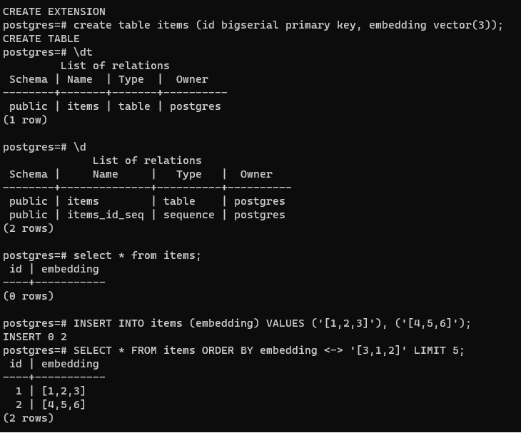

# Postgresql Vector Quickstart

## Overview

Notes on using the `pgvector` extension for PostgreSQL.

## Prerequisites

- Install PostgreSQL.
- Use the [instructions here](https://github.com/pgvector/pgvector) to install the `pgvector` extension.

## Using the Extension on WSL (Windows with Ubuntu)

- The installation of `pgvector` required a build that didn't work without the PostgreSQL development files. To install them:
  
  ```bash
  sudo apt install postgresql-server-dev-15
  ```

## Example of the output from the GEtting Started instructions

